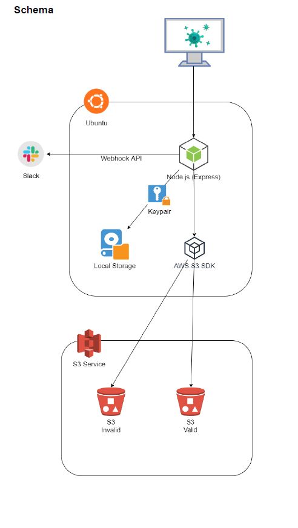

<h1>Approach</h1>
❖ Node.js checks whether the file extension is .xml and the content contains the
word “Lab”. 
❖ Integration to Slack api to send message for invalid files
❖ Using a private key to send the files to the Ubuntu server to prevent the man in
the middle attack. 
❖ Files will be deleted from the server after moving to the S3 buckets to reduce the
attack surface. 
❖ AWS.S3 SDK returns error in case of invalid file transmitting to the AWS. 

<h1>Flow</h1>
1. User uploads a file via frontend input, Node.js (Express) server serves the
request and stores the file in a local server’s directory. 
2. The file is sent to the server with a private key, and verified using the public key. 
3. Node.js checks whether the file extension is .xml and the content contains the
word “Lab”. 
4. In case of invalid file extension/content: 
a. Message sent to Slack via Webhook API 
b. File sent to S3 Invalid bucket 
5. In case of valid file: 
a. File sent to S3 Valid bucket 
6. Files are sent to AWS via AWS.S3 sdk. 